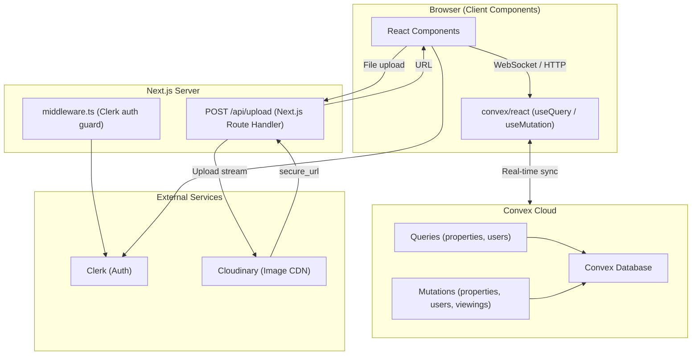
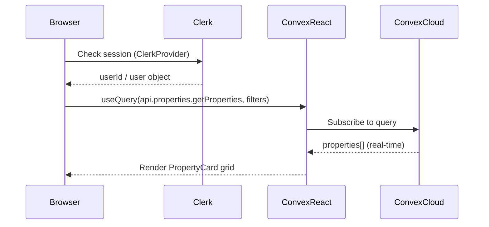
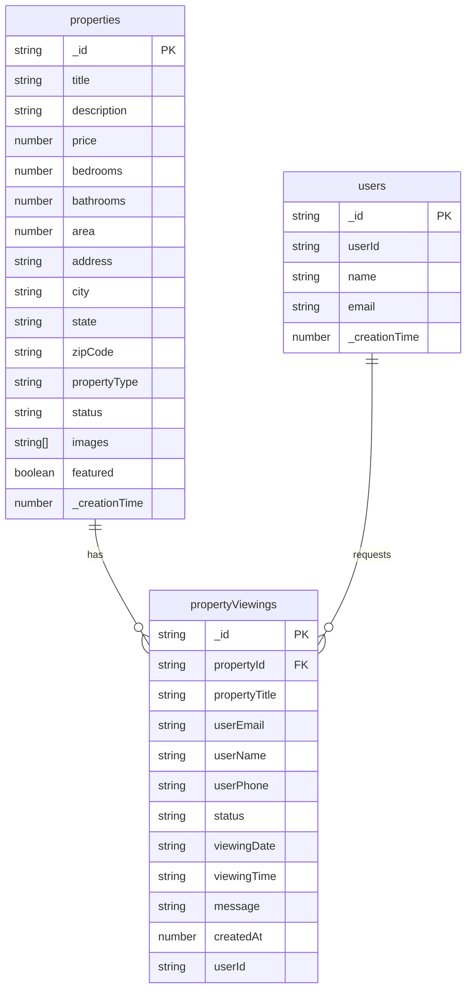
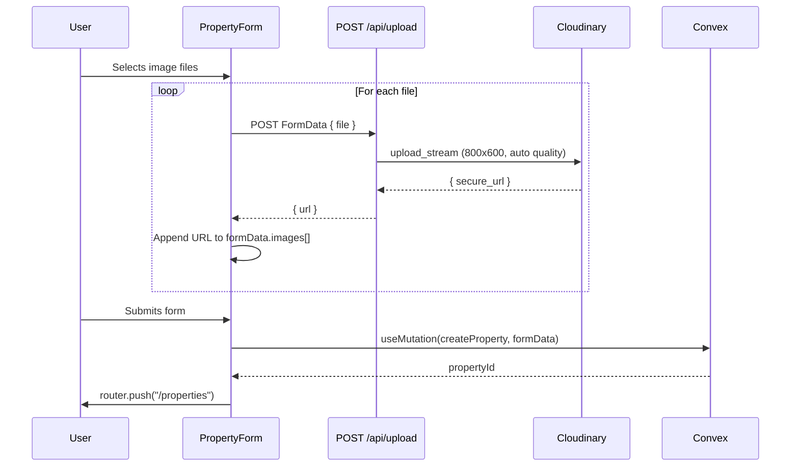

# 🏠 Real Estate App

> **Project Type: Full-Stack** — Next.js frontend + Convex BaaS (Backend-as-a-Service) in a single repository.

A full-stack real estate listing platform that allows users to browse, create, edit, and schedule viewings for properties. Authentication is handled via Clerk and images are stored on Cloudinary. All real-time data is managed through Convex's reactive database.

**Current Status:** MVP / In Development — core CRUD and viewing-scheduling flows are fully implemented. No tests, CI/CD pipeline, or production deployment configuration is present.

---

## 📋 Table of Contents

- [Features](#features)
- [Tech Stack](#tech-stack)
- [System Architecture](#system-architecture)
- [Database Schema](#database-schema--erd)
- [Frontend Architecture](#frontend-architecture)
- [Key Flows](#key-flows)
- [API Documentation](#api-documentation)
- [Getting Started](#getting-started)
- [Environment Variables](#environment-variables)
- [Known Issues](#known-issues)

---

## ✨ Features

### Core Features

| Domain | Feature | Description |
|--------|---------|-------------|
| **Properties** | Browse Listings | View all properties with real-time updates from Convex |
| **Properties** | Advanced Filtering | Filter by type, status, bedrooms, bathrooms, min/max price |
| **Properties** | Sorting | Sort by newest, price low-to-high, price high-to-low |
| **Properties** | Property Detail | Full detail page with image gallery (thumbnail selector), specs, and description |
| **Properties** | Create Property | Auth-gated form to list a new property with multi-image upload |
| **Properties** | Edit Property | Pre-filled form to update any existing listing |
| **Properties** | Delete Property | One-click delete from the detail page (auth-gated) |
| **Properties** | Featured Listings | Mark properties as featured; displayed on the homepage |
| **Auth** | Sign In / Sign Up | Clerk-powered authentication with dedicated pages |
| **Auth** | Route Protection | Middleware protects `/properties/new`, `/properties/:id/edit`, and all non-public routes |
| **Auth** | User Sync | Authenticated users are automatically synced to Convex DB on login |
| **Viewings** | Schedule Viewing | Authenticated users can book a property viewing with date (calendar picker), time slot, phone, and optional message |
| **Images** | Cloudinary Upload | Images are uploaded to Cloudinary via a Next.js API route; stored URLs are saved in Convex |
| **Contact** | Agent Contact | "Contact Agent" dialog shows a hardcoded WhatsApp number |

### Secondary / Informational Features

| Feature | Description |
|---------|-------------|
| Stats Section | Homepage displays static counters (500+ properties, 200+ clients, etc.) |
| About Page | Static informational page |
| Contact Page | Static contact page |
| "Save Property" button | Button exists on property detail page but has **no implementation** (scaffold only) |
| URL-Synced Filters | Active filters are reflected in the URL query string for shareability/bookmarking |

---

## 🛠 Tech Stack

### Frontend
| Technology | Version | Purpose |
|------------|---------|---------|
| Next.js | 15.5.4 | React framework with App Router |
| React | 19.1.0 | UI library |
| TypeScript | ^5 | Type safety |
| Tailwind CSS | ^4 | Utility-first styling |
| Framer Motion | ^12.23.24 | Animations (installed, usage in landing sections) |
| shadcn/ui (Radix UI) | — | Dialog, Label, Input, Textarea, Calendar, Button components |
| Lucide React | ^0.544.0 | Icon library |
| react-day-picker | ^9.11.1 | Calendar component for viewing scheduler |
| date-fns | ^4.1.0 | Date formatting |
| class-variance-authority + clsx + tailwind-merge | latest | Conditional className utility (shadcn/ui pattern) |

### Backend / BaaS
| Technology | Version | Purpose |
|------------|---------|---------|
| Convex | ^1.27.3 | Real-time database, queries, mutations, serverless functions |
| Cloudinary SDK | ^2.7.0 | Server-side image upload processing |
| Next.js API Routes | — | Single upload endpoint (`POST /api/upload`) |

### Auth
| Technology | Version | Purpose |
|------------|---------|---------|
| Clerk (`@clerk/nextjs`) | ^6.33.1 | Authentication, session management, middleware |

### Build / Tooling
| Technology | Details |
|------------|---------|
| Turbopack | Used for both `dev` and `build` scripts |
| PostCSS | `@tailwindcss/postcss ^4` |
| tw-animate-css | `^1.4.0` — Tailwind animation utilities |

---

## 🏗 System Architecture

**Pattern:** Modular monolith. Frontend (Next.js App Router) and backend functions (Convex) live in the same repo. Convex acts as a BaaS — it runs its own cloud infrastructure; only the schema and function definitions are stored locally.



### Request Lifecycle — Property Listing with Filter



---

## 🗄 Database Schema & ERD

All tables are defined in [`convex/schema.ts`](convex/schema.ts).

### Tables

#### `users`
| Field | Type | Notes |
|-------|------|-------|
| `_id` | `Id<"users">` | Auto-generated by Convex |
| `_creationTime` | `number` | Auto-generated timestamp |
| `userId` | `string` | Clerk user ID |
| `name` | `string` | Full name from Clerk |
| `email` | `string` | Primary email from Clerk |

**Indexes:** `by_user_id` (userId), `by_email` (email)

---

#### `properties`
| Field | Type | Notes |
|-------|------|-------|
| `_id` | `Id<"properties">` | Auto-generated |
| `_creationTime` | `number` | Used for "newest" sort |
| `title` | `string` | |
| `description` | `string` | |
| `price` | `number` | |
| `bedrooms` | `number` | |
| `bathrooms` | `number` | |
| `area` | `number` | Square footage |
| `address` | `string` | |
| `city` | `string` | |
| `state` | `string` | |
| `zipCode` | `string` | |
| `propertyType` | `union` | `house \| apartment \| condo \| townhouse \| cabin \| villa \| studio \| cottage` |
| `status` | `union` | `for-sale \| for-rent \| sold \| rented` |
| `images` | `string[]` | Cloudinary URLs |
| `featured` | `boolean?` | Optional, defaults to `false` |

**Indexes:** none (full table scans, filtered in-memory in the Convex function)

---

#### `propertyViewings`
| Field | Type | Notes |
|-------|------|-------|
| `_id` | `Id<"propertyViewings">` | Auto-generated |
| `_creationTime` | `number` | Auto |
| `propertyId` | `Id<"properties">` | Foreign reference (no cascade enforced by Convex) |
| `propertyTitle` | `string` | Denormalized copy of title |
| `userEmail` | `string` | |
| `userName` | `string` | |
| `userPhone` | `string?` | Optional |
| `status` | `union` | `pending \| confirmed` — always created as `pending` |
| `viewingDate` | `string` | Format: `yyyy-MM-dd` |
| `viewingTime` | `string` | Format: `HH:mm` |
| `message` | `string?` | Optional user message |
| `createdAt` | `number` | `Date.now()` |
| `userId` | `string?` | Clerk user ID (optional) |

**Indexes:** `by_property` (propertyId), `by_user` (userId), `by_email` (userEmail)

---



> **Note:** Convex does not enforce foreign key constraints. `propertyViewings.propertyId` references `properties._id` by convention only. If a property is deleted, its associated viewings are **not** automatically removed.

---

## 🖥 Frontend Architecture

### Folder Structure

```
app/
├── _components/          # Shared page-level components
│   ├── ConnectingPeople.tsx
│   ├── FeaturedProperties.tsx
│   ├── Footer.tsx
│   ├── Hero.tsx
│   ├── Navbar.tsx
│   ├── PropertyCard.tsx
│   ├── PropertyFilters.tsx
│   ├── PropertyForm.tsx      # Create + Edit (isEditing flag)
│   ├── ScheduleViewing.tsx
│   ├── WhatClientWant.tsx
│   └── WhatWeDo.tsx
├── api/upload/route.tsx  # Next.js Route Handler (Cloudinary upload)
├── about/page.tsx
├── contact/page.tsx
├── properties/
│   ├── page.tsx              # Listing page with filters
│   ├── new/page.tsx          # Create property (auth-gated)
│   └── [id]/
│       ├── page.tsx          # Property detail
│       └── edit/page.tsx     # Edit property (auth-gated)
├── sign-in/[[...sign-in]]/page.tsx
├── sign-up/[[...sign-up]]/page.tsx
├── ConnectUserToConvex.tsx   # Invisible sync component
├── ConvexClientProvider.tsx  # Convex context wrapper
├── layout.tsx
└── page.tsx                  # Homepage

components/ui/        # shadcn/ui primitives (Button, Dialog, Input, etc.)
convex/               # Convex schema + server functions
types/                # Shared TypeScript types
```

### State Management

| Scope | Mechanism |
|-------|-----------|
| Server/async data | `useQuery` / `useMutation` from `convex/react` — auto-reactive, no manual caching |
| Local UI state | `useState` (filter state, image selection, form fields, dialog open/close) |
| Auth state | `useUser`, `useAuth` from `@clerk/nextjs` |
| URL state | `useSearchParams` / `router.replace` for filter persistence |

No external state manager (Redux, Zustand, Jotai) is used. Convex's reactive queries replace the need for a client-side data cache.

### Routing

| Route | Auth Required | Description |
|-------|--------------|-------------|
| `/` | ❌ | Homepage (Hero, FeaturedProperties, sections) |
| `/properties` | ❌ | Property listing with sidebar filters |
| `/properties/new` | ✅ | Create property form |
| `/properties/[id]` | ❌ | Property detail page |
| `/properties/[id]/edit` | ✅ | Edit property form |
| `/about` | ✅ | Static about page |
| `/contact` | ✅ | Static contact page |
| `/sign-in` | ❌ | Clerk sign-in |
| `/sign-up` | ❌ | Clerk sign-up |

### Design System

- **Tailwind CSS v4** with `tw-animate-css` for animation utilities
- **shadcn/ui** component primitives built on Radix UI
- **Brand color:** `#e04141` (red) used consistently for CTAs and accents
- **Fonts:** Geist Sans + Geist Mono (via `next/font`)
- **Responsive:** Mobile-first with hamburger menu (full-screen overlay) for `< md` breakpoints

---

## 🔄 Key Flows

### 1. User Authentication & Convex Sync

```
User clicks "Get Started"
  → Clerk SignInButton → Clerk hosted sign-in UI
  → Clerk sets session → ClerkProvider propagates user state
  → ConnectUserToConvex (useEffect) detects user
  → Calls useMutation(api.users.updateUser)
  → Convex upserts user record (create if new, patch if exists)
```

**Files:** `app/ConnectUserToConvex.tsx`, `convex/users.tsx`

---

### 2. Property Listing with Filters

```
User visits /properties
  → Filter state initialized from URL searchParams
  → useQuery(api.properties.getProperties, filters) subscribes
  → Convex returns full table, filters/sorts in-memory in server function
  → On filter change → setFilters() → router.replace() updates URL
  → Convex re-runs query, pushes updated results via WebSocket
  → PropertyCard grid re-renders reactively
```

**Files:** `app/properties/page.tsx`, `app/_components/PropertyFilters.tsx`, `convex/properties.ts`

---

### 3. Create Property with Image Upload



**Files:** `app/_components/PropertyForm.tsx`, `app/api/upload/route.tsx`, `convex/properties.ts`

---

### 4. Schedule a Viewing

```
User on /properties/[id]
  → Clicks "Schedule Viewing" → Radix Dialog opens
  → Selects date (react-day-picker, past dates disabled)
  → Selects time slot from grid (09:00–17:30, 30-min intervals)
  → Optionally fills phone and message
  → Submits → useMutation(api.propertyViewings.createViewing)
  → Convex inserts viewing record with status: "pending"
  → Success state shown for 2s → form resets
```

**Files:** `app/_components/ScheduleViewing.tsx`, `convex/propertyViewings.ts`

---

### 5. Edit / Delete Property

```
User on /properties/[id] (must be signed in)
  → Edit: navigates to /properties/[id]/edit
    → useQuery fetches existing data → PropertyForm prefilled
    → On submit → useMutation(updateProperty) → ctx.db.patch()
  → Delete: Button → useMutation(deleteProperty) → ctx.db.delete()
    → router.push("/") on success
```

---

## 📡 API Documentation

### Next.js Route Handlers

#### `POST /api/upload`

Uploads a single image file to Cloudinary and returns its CDN URL.

| | Details |
|-|---------|
| **Auth** | None enforced at route level |
| **Content-Type** | `multipart/form-data` |

**Request Body (FormData):**
| Field | Type | Required |
|-------|------|----------|
| `file` | `File` | ✅ |

**Responses:**
| Status | Body |
|--------|------|
| `200` | `{ "url": "https://res.cloudinary.com/..." }` |
| `400` | `{ "error": "No file provided" }` |
| `500` | `{ "error": "Upload failed" }` |

**Cloudinary transform:** `width: 800, height: 600, crop: fill, quality: auto`

---

### Convex Functions

Called from the client via `useQuery` / `useMutation` with the generated `api` object.

#### Properties (`convex/properties.ts`)

| Function | Type | Key Args | Returns |
|----------|------|---------|---------|
| `getProperties` | query | `propertyType?, status?, minPrice?, maxPrice?, bedrooms?, bathrooms?, sortOption?` | `Property[]` |
| `getSingleProperty` | query | `id` | `Property \| null` |
| `getFeaturedProperties` | query | — | `Property[]` |
| `createProperty` | mutation | Full property fields | `Id<"properties">` |
| `updateProperty` | mutation | `id` + full property fields | `void` |
| `deleteProperty` | mutation | `id` | `void` |

#### Users (`convex/users.tsx`)

| Function | Type | Args | Returns |
|----------|------|------|---------|
| `updateUser` | mutation | `userId, name, email` | User doc or new `Id<"users">` |

#### Property Viewings (`convex/propertyViewings.ts`)

| Function | Type | Args | Returns |
|----------|------|------|---------|
| `createViewing` | mutation | `propertyId, propertyTitle, userEmail, userName, userPhone?, viewingDate, viewingTime, message?, userId?` | `Id<"propertyViewings">` |

---

## 🚀 Getting Started

### Prerequisites

- Node.js 18+
- [Convex](https://convex.dev) account
- [Clerk](https://clerk.com) account
- [Cloudinary](https://cloudinary.com) account

### Installation

```bash
git clone https://github.com/mohamednagy54/Realstate-App.git
cd Realstate-App
npm install
```

### Setup Convex

```bash
npx convex dev
```

This will prompt you to log in and link a Convex project. It auto-generates `.env.local` with `CONVEX_DEPLOYMENT` and `NEXT_PUBLIC_CONVEX_URL`.

### Environment Variables

Create a `.env` file in the project root (see `.env.example` for reference):

```env
# Clerk
NEXT_PUBLIC_CLERK_PUBLISHABLE_KEY=pk_...
CLERK_SECRET_KEY=sk_...
NEXT_PUBLIC_CLERK_SIGN_IN_URL=/sign-in
NEXT_PUBLIC_CLERK_SIGN_UP_URL=/sign-up
NEXT_PUBLIC_CLERK_SIGN_IN_FALLBACK_REDIRECT_URL=/
NEXT_PUBLIC_CLERK_SIGN_UP_FALLBACK_REDIRECT_URL=/

# Cloudinary
NEXT_PUBLIC_CLOUDINARY_CLOUD_NAME=your_cloud_name
NEXT_PUBLIC_CLOUDINARY_API_KEY=your_api_key
CLOUDINARY_API_SECRET=your_api_secret
```

`.env.local` is auto-generated by `npx convex dev`:
```env
CONVEX_DEPLOYMENT=dev:...
NEXT_PUBLIC_CONVEX_URL=https://...convex.cloud
```

### Run Development Server

```bash
# Terminal 1 — Convex backend
npx convex dev

# Terminal 2 — Next.js frontend
npm run dev
```

Open [http://localhost:3000](http://localhost:3000)

---

## ⚠️ Known Issues & Technical Debt

| Issue | Location | Severity |
|-------|----------|----------|
| No ownership check on edit/delete — any signed-in user can mutate any property | `properties/[id]/page.tsx`, `convex/properties.ts` | 🔴 High |
| "Save Property" button is a stub with no implementation | `properties/[id]/page.tsx` | 🟡 Medium |
| Duplicate `PropertyType` declaration causes TypeScript error | `types/index.ts` L5+L7 | 🟡 Medium |
| `useRouter` imported from `next/router` (Pages Router) instead of `next/navigation` | `app/_components/PropertyFilters.tsx` | 🟡 Medium |
| No viewing management — viewings always stay `pending`, no admin UI | `convex/propertyViewings.ts` | 🟡 Medium |
| Hardcoded WhatsApp contact number | `properties/[id]/page.tsx` | 🟡 Medium |
| Full table scan on `getProperties` — no DB-level indexes used for filtering | `convex/properties.ts` | 🟠 Scalability |
| `/about` and `/contact` are auth-gated despite being static pages | `middleware.ts` | 🟢 Low |
| Default page metadata — title is still "Create Next App" | `app/layout.tsx` | 🟢 Low |
| Zero tests (unit, integration, e2e) | entire project | 🟡 Medium |

---

## 🔑 Key Technical Decisions

| Decision | Rationale |
|----------|-----------|
| **Convex over traditional REST API** | Eliminates boilerplate API routes for CRUD; provides real-time reactivity via WebSocket subscriptions. `useQuery` keeps the UI in sync without manual cache invalidation. |
| **Clerk for auth** | Zero-config authentication with pre-built UI. `clerkMiddleware` protects routes at the edge without custom JWT handling. |
| **Cloudinary via Next.js API Route** | Cloudinary's server SDK requires the secret key server-side. The `/api/upload` route acts as a secure proxy to avoid exposing credentials to the client. |
| **`PropertyForm` with `isEditing` flag** | Single component handles create and edit to avoid duplicating form logic. Trade-off: slightly more complex single file vs. two simpler ones. |
| **`ConnectUserToConvex` as an invisible component** | User sync runs as a side effect mounted in the root layout. Keeps Convex `users` table in sync with Clerk on every session without requiring Clerk webhooks. |
| **URL-synced filter state** | Filters are reflected in the URL query string, enabling shareable/bookmarkable filtered views without an additional URL state library. |
| **Turbopack** | Enabled for both dev and build for faster compile times. Note: `next build --turbopack` is still experimental in Next.js 15. |
